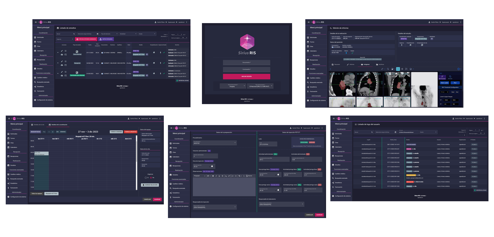

**Sirius RIS** is an **open source** radiological information system that was developed thanks to the following technologies: [Angular](https://angular.io/), [RxJS](https://rxjs.dev/), [OHIF](https://ohif.org/), [NodeJS](https://nodejs.org/), [MongoDB](https://www.mongodb.com/) and [Docker](https://www.docker.com/).

#### Features

* Simple, efficient and fast.

* Robust, secure and auditable.

* Opaque interface to preserve radiological environments.

* Unambiguous identification of people [ [**ISO-3166**](https://www.iso.org/iso-3166-country-codes.html) | **[UNAOID/ICAO v1.0](https://www.unaoid.gub.uy/descargas/especificaciones-identifican-personas.pdf)** ].

* System of **scalable privileges** for users.

* Backend **multilanguage** ( `English` , `Spanish` ).

  

---

#### MWL and DICOM images

**Sirius RIS** works together with two other services with which it interacts for the management of **MWL** and **DICOM** images:

* [wezen](https://hub.docker.com/r/opendicom/wezen)
* [dockerpacs](https://hub.docker.com/r/opendicom/dcm4chee)

---

## Getting Started

1. [Deployment](./documentation/01_deployment.md)
2. [Architecture](./documentation/02_architecture.md)
3. [Security](./documentation/03_security.md)
4. [Sirius Backend `API REST`](./documentation/04_sirius_backend_api_rest.md)
5. [Sirius Web Module](https://github.com/opendicom/sirius-web)
6. [Development guide](./documentation/06_development.md)
7. [Scheduled tasks and Backups](./documentation/07_scheduled_tasks_and_backups.md)

---

## Official Support

**[opendicom](https://github.com/opendicom)** is a company that provides **PACS** and **RIS** services to hospitals and imaging clinic clients based on its own and third-party **opensource** software.

The business model does not include charitable support, but allows collaboration with local IT professionals and knowledge transfer knowledge transfer so that it is beneficial to both parties in the long term.

Through the following contact you can request a demo, commercial proposal, or submit a collaboration proposal.

**Jacques Fauquex**
jacquesfauquex@opendicom.com

---

## License

**Sirius RIS** is licensed by [Mozilla Public License 2.0](https://choosealicense.com/licenses/mpl-2.0/).
