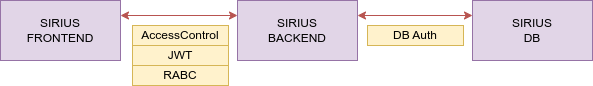
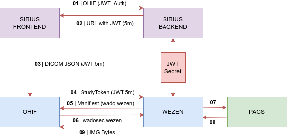
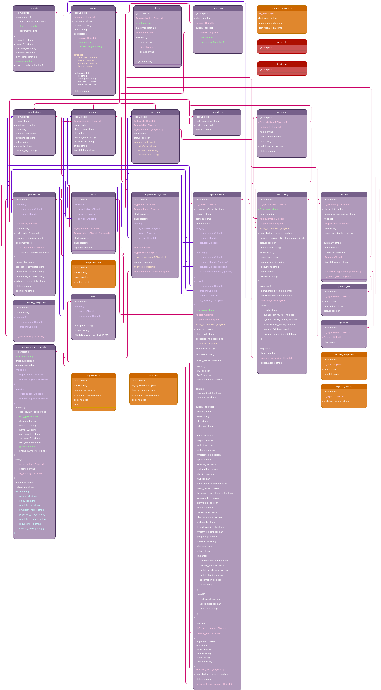

# Architecture

This document will detail the main aspects of the **Sirius RIS** architecture.

---


## Services

The **Sirius RIS** stack is made up of three simple elements: 

* Frontend `Web server | nginx`
* Backend server `API RESTful | NodeJS`
* Database server `MongoDB`





---


## Communication with Wezen

The numbers in the diagram represents the steps in the communication sequence.





> **URL with JWT (5m) Example:**
> http://FRONTEND_HOST:FRONTEND_PORT/dcm-viewer/viewer/dicomjson?url=http%3A%2F%2FWEZEN_HOST%3AWEZEN_PORT%2FstudyToken%3FaccessType%3Dohif%26token%3DJWT_5m%26StudyInstanceUID%3D2.3.5.345...


---


## UML

Inside the resources directory of this repository you can find the **UML** diagram of the **Sirius RIS** data collections.





---


## Modality Worklist HL7 `ORM | MLLP`

The modality work list (**MWL**), is built from **Sirius RIS** at the time of check-in for a patient who attends their appointment.
The patient data and the procedure to be performed are sent by **MLLP** in an **HL7 v2** message to the **PACS** that is configured in the installation (**environments**).


#### Sirius RIS HL7 Message Structure

The segments (lines) are separated by =x0D

```
MSH|^~\\&|||||||ORM^O01|||2.3.1
IPC|||||||SSN^^^
PID|||ID^^^II||PN||PB|PS
ORC|NW||||||^^^DT^^PR||||||||||RS
OBR||||^^^SD_CODE^SD^CSD||||||||||||^RQ||AN|RP|SS|AE|||MO||||||||||PP|||||||||RD
ZDS|UI
```


- **ID**: Patient identifier [PID-3] (0010,0020)

- **II**: ID issuer [PID-3.5] (0010,0021) `UNAOID-ICAO v1.0`

- **PN**: Patient name [PID-5] (0010,0010) `surname_01>surname_02^name_01 name_02`

- **PB**: Patient birth date [PID-7] (0010,0030) `YYYYMMDD`

- **PS**: Patient sex [PID-8] (0010,0040) `M | F | O`

- **RF**: Referring physician (PV1-8, 0008,0090) `PV1||||||||^RF`  *optional segment*

- **DT**: Date time [ORC-7.4] (0040,0002 | 0040,0003) `YYYYMMDDHHMM`

- **PR**: Procedure Priority HL7 codes `S (Stat), A (ASAP), R (Routine), P (Pre-op), C (Callback), T (Timing)`

- **SD**: SPS description / code [OBR-4.4] (0040,0007) [OBR-4.3+4+5] (0040,0008)

- **SD_CODE**: Procedure Description ID, Steps (0008,0100) `Code Value`

- **CSD**: Coding Scheme Designator (0008,0102) *optional*

- **RQ**: Requesting Physician [OBR-16] (0032,1032) [Referring] `surname_01>surname_02^name_01 name_02`

- **AN**: Accession number [OBR-18] (0008,0050) `unique number | 16 chars max`

- **RP**: Requested Procedure ID [OBR-19] (0040,1001) `cannot be null | 16 chars max`

- **SS**: Scheduled step ID [OBR-20] (0040,0009) *optional*

- **AE**: Scheduled station AET [OBR-21] (0040,0001) `AET equipment` *optional*

- **SSN**: Scheduled Station Name (0040,0010) *optional*

- **MO**: Modality [OBR-24] (0008,0060) `code_value`

- **PP**: Performing Physician [OBR-34] (0040,0006) [Reporting] `organization_short_name^branch_short_name^surname_01>surname_02^name_01 name_02`

- **RD**: Requesting Procedure Description | RP desc/code [OBR-44^2] (0032,1060) [OBR-4.1^2^3] (0032,1064)

- **UI**: studyUID [ZDS-1] (0020,000D)

- **RS**: Requesting Service (0032,1033) [ORC-17] [Referring]

  `organization_short_name^branch_short_name^service_name`


---


## Global elements

Throughout the entire **Sirius RIS** application, reference is made on many occasions to **indexes** of global elements which will be detailed below to improve the understanding of the code and maintenance of the application itself.


### Document types

| Key  | Value                            |
| ---- | -------------------------------- |
| 1    | ID Nacional (DNI, CI, CURP, RUT) |
| 2    | Pasaporte                        |
| 3    | Credencial cívica                |
| 4    | Licencia de conducir             |
| 5    | Permiso de residencia            |
| 6    | Visa                             |
| 7    | Documento transitorio            |


> The **Document types** reference table was collated based on the document types supported by country worldwide. That is, the documents that had the greatest number of repetitions in terms of being accepted as valid in different countries (Ref: https://onfido.com/supported-documents/).


---


### User roles

| Key  | Value         |
| ---- | ------------- |
| 1    | Superusuario  |
| 2    | Administrador |
| 3    | Supervisor    |
| 4    | Médico        |
| 5    | Técnico       |
| 6    | Enfermero     |
| 7    | Coordinador   |
| 8    | Recepcionista |
| 9    | Paciente      |
| 10   | Funcional     |


---


### User concessions

| Key  | Value                                   |
| ---- | --------------------------------------- |
| 1    | Gestión de turnos                       |
| 2    | Gestión de citas                        |
| 3    | Calendario de citas                     |
| 4    | Gestión de recepciones                  |
| 5    | Gestión de estudios                     |
| 6    | Gestión de informes                     |
| 7    | Firmar informes                         |
| 8    | Autenticar informes                     |
| 9    | Enmendar informes                       |
| 10   | Acceso a logs del usuario               |
| 11   | Acceso a logs de elementos              |
| 12   | Reenvío de correos                      |
| 13   | Gestión de solicitudes                  |
| 14   | Búsquedas avanzadas                     |
| 15   | Listados de facturación                 |
| 16   | Estadísticas generales                  |
| 17   | Estadísticas médicas                    |
| 18   | Estadísticas del personal               |
| 19   | Eliminación física de archivos          |
| 20   | Acceso al módulo de exportación         |
| 21   | Acceso al servicio de imágenes del PACS |
| 22   | Edición de identificación de pacientes  |
| 23   | Sobreagenda (overbooking)               |


---


### Genres

| Key  | Value  |
| ---- | ------ |
| 1    | Male   |
| 2    | Female |
| 3    | Other  |


---


### Event logs

| Key  | Value                                              |
| ---- | -------------------------------------------------- |
| 1    | Login                                              |
| 2    | Insert `ELEMENT`                                   |
| 3    | Update `ELEMENT`                                   |
| 4    | Delete `ELEMENT`                                   |
| 5    | Sign `Only for report ELEMENT`                     |
| 6    | Authentication `Only for report ELEMENT`           |
| 7    | Send email `For appointments and reports ELEMENTS` |


---


### Flow states

The following references were defined to be able to establish the **flow control** of the elements that will be detailed below.


##### Appointment requests

| Key  | Value                                          |
| ---- | ---------------------------------------------- |
| AR01 | Administración                                 |
| AR02 | Retenida en administración                     |
| AR03 | Área médica                                    |
| AR04 | Retenida en área médica                        |
| AR05 | Cita en curso creada `Controlled from backend` |
| AR06 | Cita creada `Controlled from backend`          |
| AR07 | Cancelada                                      |


##### Appointments

| Key  | Value                |
| ---- | -------------------- |
| A01  | Coordinada           |
| A02  | Cancelada-suspendida |


##### Performing

| Key  | Value                                             |
| ---- | ------------------------------------------------- |
| P01  | Recepción                                         |
| P02  | Entrevista                                        |
| P03  | Preparación/Inyección                             |
| P04  | Adquisición                                       |
| P05  | Verificación de imágenes                          |
| P06  | Para informar                                     |
| P07  | Informe borrador `Controlled from backend`        |
| P08  | Informe firmado `Controlled from backend`         |
| P09  | Terminado (con informe) `Controlled from backend` |
| P10  | Terminado (sin informe)                           |
| P11  | Cancelado                                         |


---


### Cancellation reasons

| Key  | Value                                    |
| ---- | ---------------------------------------- |
| 1    | Falla en equipo                          |
| 2    | Falta consentimiento                     |
| 3    | Indicacion incorrecta                    |
| 4    | No se presentó                           |
| 5    | Sin preparacion o preparación incorrecta |
| 6    | Claustrofóbia                            |
| 7    | Embarazo                                 |
| 8    | Hiperglicemia                            |
| 9    | Hipoglicemia                             |
| 10   | Cursando infección                       |
| 11   | Fallecimiento                            |
| 12   | Otro                                     |


---


### Inpatient types

| Key  | Value               |
| ---- | ------------------- |
| 1    | Cuidados intensivos |
| 2    | Emergencia          |
| 3    | Internación         |

