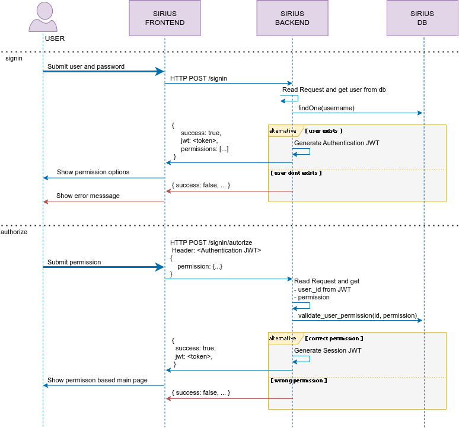

# Security

**Sirius RIS** has several security mechanisms throughout the entire flow of information that it handles.
The main mechanisms will be detailed in broad strokes below.


## Access Control  `Middleware`

It corresponds to the implementation of a mechanism to prevent 2 security aspects:

- The flood of malicious requests with the objective of trying to find out a username/password of the system or generate DDoS.
- Deny unauthorized access based on system Tokens.


The **Access Control** can be configured from the **environment variables** detailed in the [deployment section](./01_deployment.md).

```bash
# Maximum number (AC_NUMBER_OF_ATTEMPTS) of requests that a client IP can make in AC_TIME_WINDOW time.
# If a client IP exceeds this condition it will be penalized for AC_PENALTY_TIME time.

SIRIUS_BACKEND_AC_NUMBER_OF_ATTEMPTS=5
SIRIUS_BACKEND_AC_TIME_WINDOW=10    # Seconds 
SIRIUS_BACKEND_AC_PENALTY_TIME=15   # Seconds
```


---


## User Authentication and Authorization

- **Authentication**: User and password validation.
- **Authorization**: Defines which part of the application (domain) an authenticated user can access.


#### User authentication and authorization flow





> **Important:**
> The authorization process is not required for users with a single ROLE (only one permission).
> In cases where the user has a single ROLE (only one permission), authentication is completed only with the first step (signin).
> That is, both authentication and authorization are completed under a single request and the JWT granted if successful is the Session one.


---


## Role Access Based Control | RABC  `Middleware`

It is a mechanism to restricting system access to authorized users, and to implementing mandatory access control or discretionary access control.

The **RABC** is responsible for granting only the information that corresponds to the authenticated user according to their role and privileges granted in the application.

Additionally **Sirius RIS** has a **RABC** that regulates what information must be provided to an authenticated user according to the following criteria:


* Domain

* Role

* Scalable permissions

  

### Domain

A user's domain can be defined at three levels:

* Organizations
* Branches
* Services


### Role

A user's role will determine the type of actions they can perform by default in the application.


### Scalable permissions

Scalable permissions (`concessions`) allow a user's access to be expanded gradually, regardless of their role.
